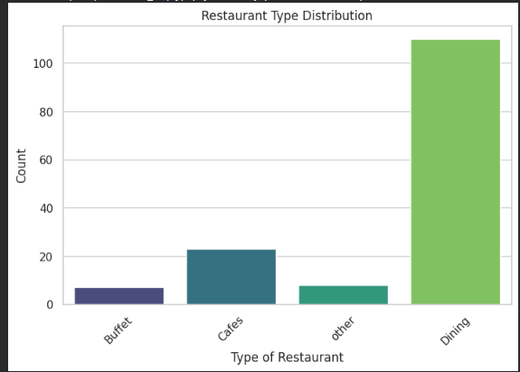
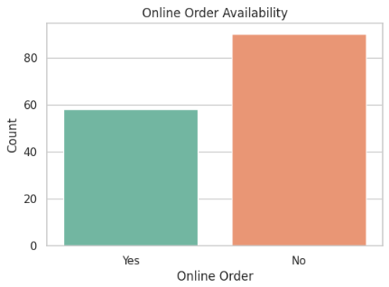
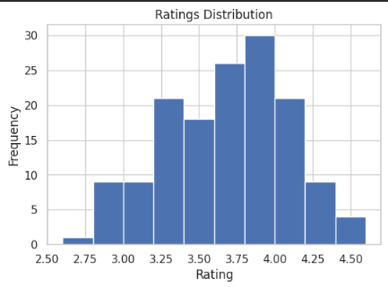
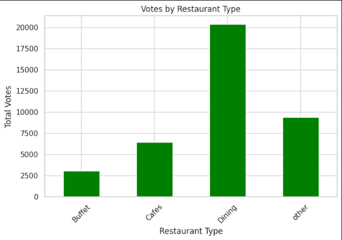
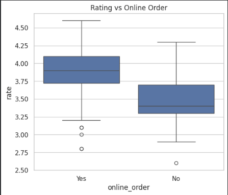
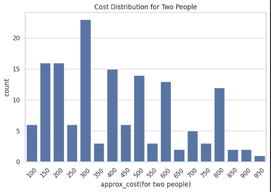
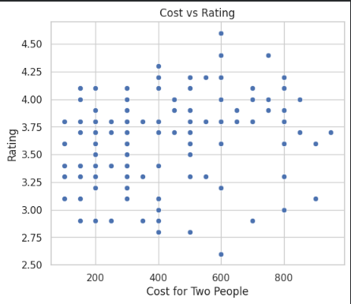
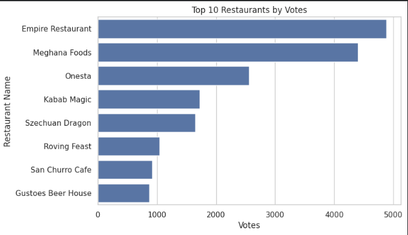
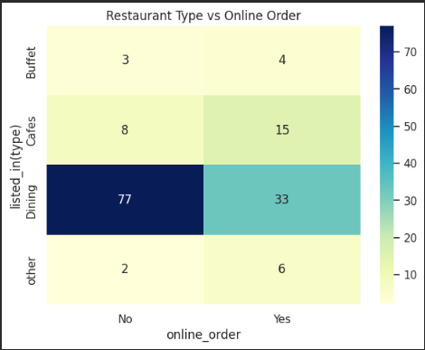
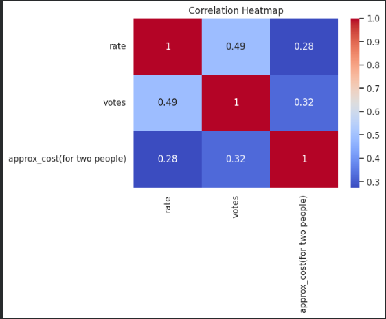

# 🍽️ Zomato Data Analysis Using Python

This project performs **Exploratory Data Analysis (EDA)** on a Zomato restaurant dataset using **Python, Pandas, Matplotlib, and Seaborn**.

The goal of this project is to understand restaurant trends such as ratings, votes, online ordering availability, and cost distribution.

---

# 📊 Technologies Used

- Python
- Pandas
- NumPy
- Matplotlib
- Seaborn
- Google Colab

---

# 📁 Dataset

Dataset used: **Zomato Restaurant Dataset**

Features include:

- Restaurant Name
- Online Order Availability
- Table Booking
- Ratings
- Votes
- Approx Cost for Two People
- Restaurant Type

---

# 📈 Data Visualizations

## 1️⃣ Restaurant Type Distribution

This graph shows how many restaurants belong to each category such as Buffet, Cafes, Dining, and Others.

---

## 2️⃣ Online Order Availability

This chart shows how many restaurants provide online ordering services.

---

## 3️⃣ Ratings Distribution

This histogram shows the distribution of restaurant ratings.

---

## 4️⃣ Votes by Restaurant Type

This graph shows which restaurant types receive the most votes from customers.

---

## 5️⃣ Rating vs Online Order

This boxplot compares ratings of restaurants that allow online ordering vs those that do not.

---

## 6️⃣ Cost Distribution

This chart shows the approximate cost for two people across restaurants.

---

## 7️⃣ Cost vs Rating

This scatter plot shows the relationship between restaurant cost and ratings.

---

## 8️⃣ Top 10 Restaurants by Votes

This visualization highlights the most popular restaurants based on customer votes.

---

## 9️⃣ Restaurant Type vs Online Order Heatmap

This heatmap shows the relationship between restaurant types and online ordering availability.

---

## 🔟 Correlation Heatmap

This heatmap shows correlations between numerical variables like ratings, votes, and cost.

---

# 📌 Key Insights

- Dining restaurants receive the highest number of votes.
- Restaurants with online ordering often have higher ratings.
- Most restaurants fall in the mid-cost range.
- Ratings generally cluster between **3.5 and 4.5**.

---
